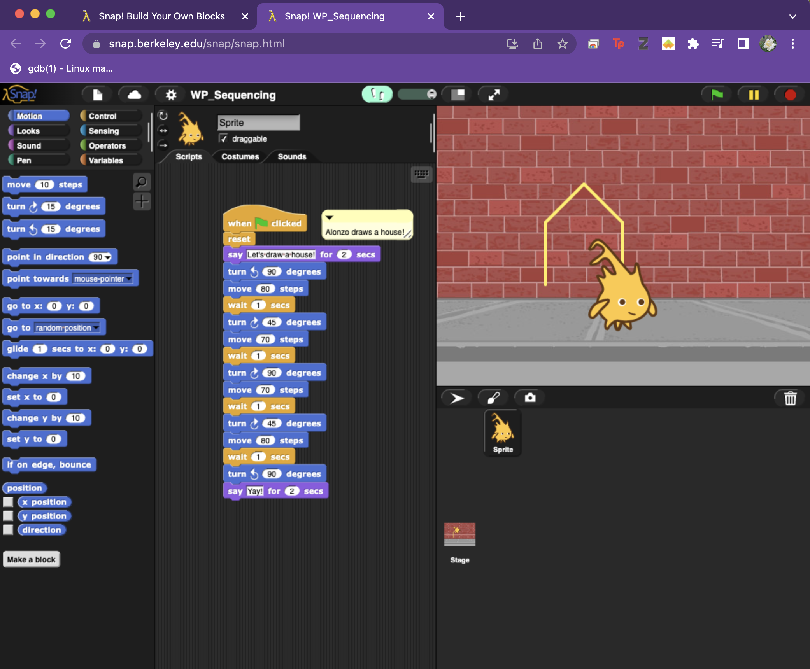
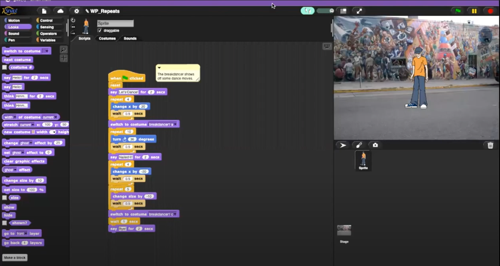
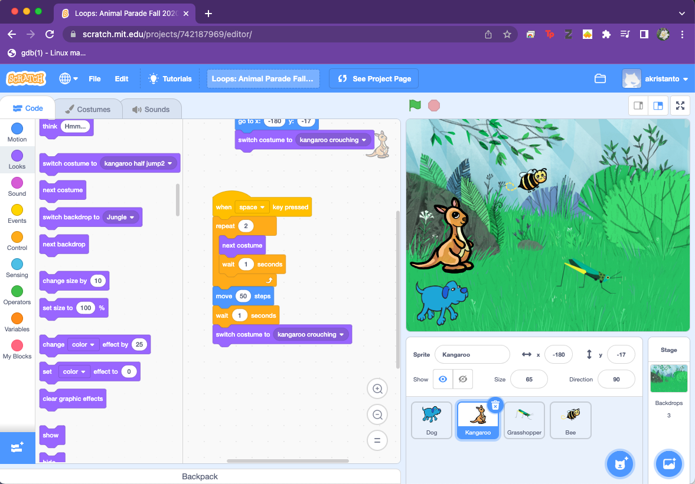
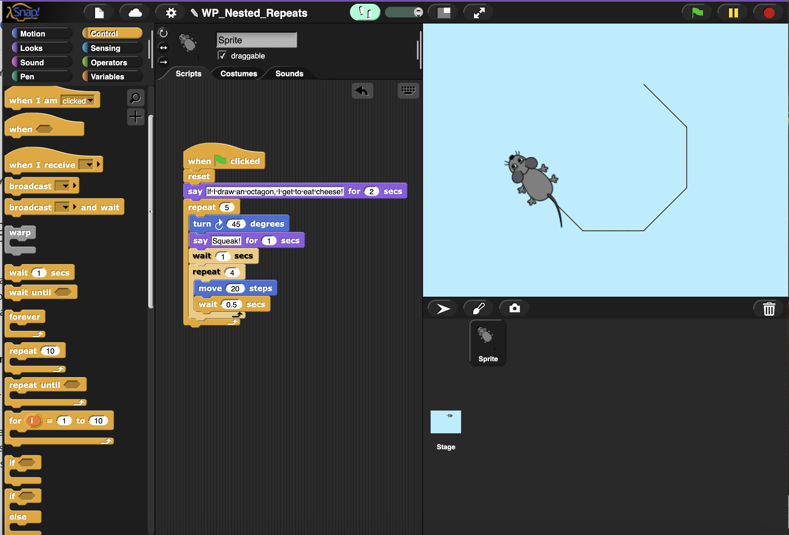
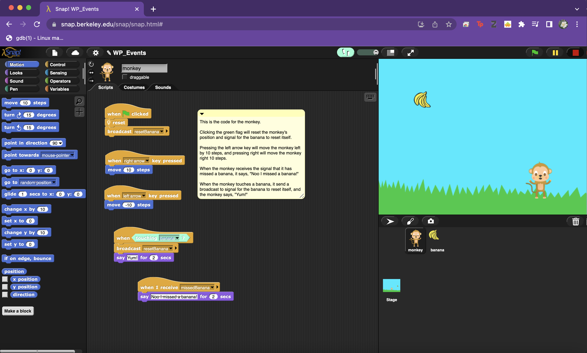
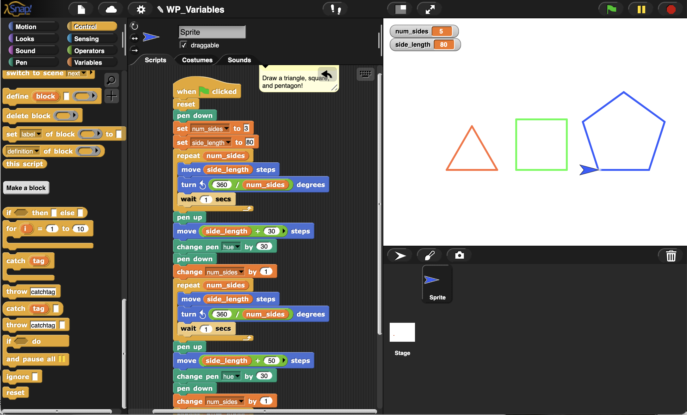
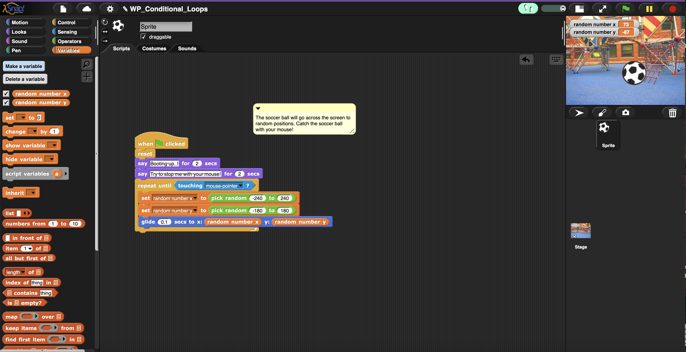
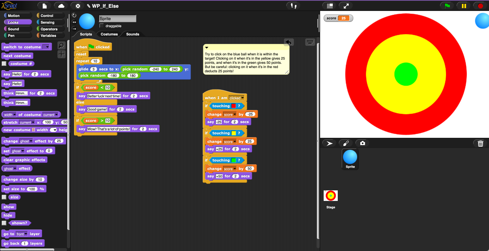
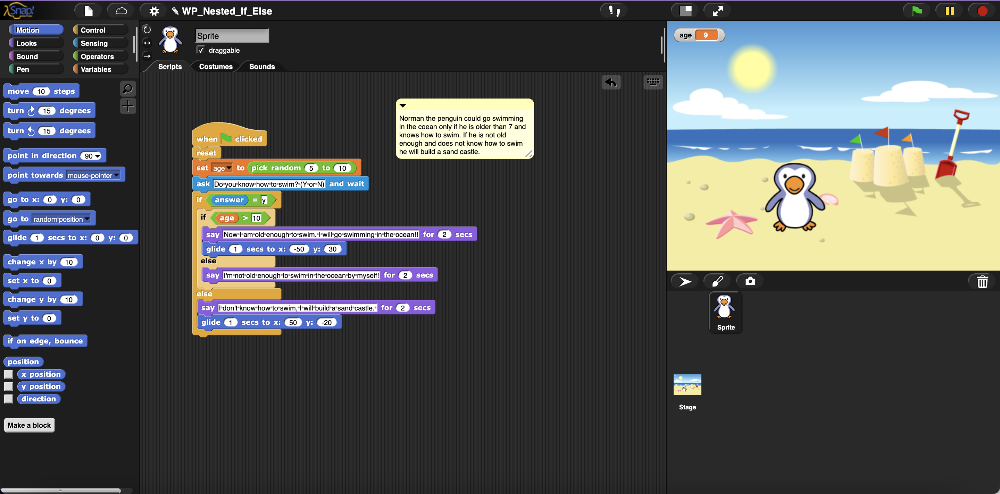

# Welcome to my EDS124BR Website! 

This website will contain all the assignments for this class. Click the image to watch the video!

--- 

## Assignment 1: Sequencing in Snap

This assignment is the first assignment and we had to explain a program by covering it's purpose and how it works. 

---

## Assignment 2: Repeats in Snap

This assignment goes into how repeats work and showcases this by Snap instructions 

---

## Assignment 3: Repeats in Scratch (Teaching Programming Portfolio Quest)

This assignment goes into how repeats work and showcases this by Scratch instructions 

---

## Assignment 4: Nested Repeats in Snap

This assignment goes into how nested repeats work and showcases this by Snap instructions 

---

## Assignment 5: Events in Snap

This assignment goes into how events work and showcases this by Snap instructions 

--- 

## Assignment 6: Variables in Snap

This assignment goes into how variables work and showcases this by Snap instructions 

--- 

## Assignment 7: Conditional Repeats in Snap

This assignment goes into how conditional repeats work and showcases this by Snap instructions 

--- 

## Assignment 8: If-else Statements in Snap

This assignment goes into how conditional if-else statements work and showcases this by Snap instructions 

--- 

## Assignment 9: Nested If-else Statements in Snap

This assignment goes into how nested if-else statements work and showcases this by Snap instructions 

